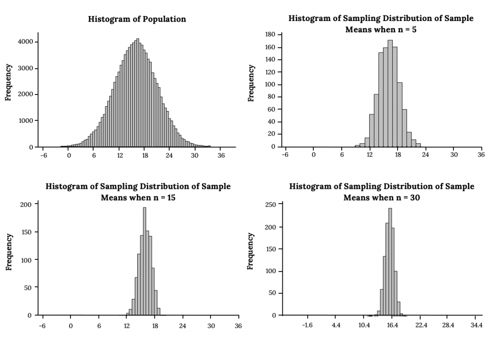
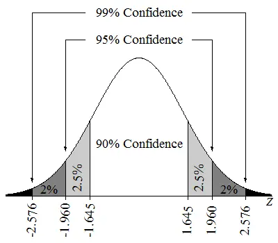

# ML Mathemetics Basics

Before understanding any machine learning model, it is essential to understand some basic mathematical concepts.

Two of the most important topics are inferential statistics and hypothesis testing
  
## Inferential Statistics 

When we talk about mean and variance, we usually refer to the sample rather than the entire population. But have we ever wondered why we rely on a sample instead of the full population?

Calculating population parameters is often impractical because it requires a large amount of memory, extensive computation, and significant time. However, by analyzing sample data, we can estimate population parameters with a certain level of confidence—which is often sufficient in practice.

Here are the forumals for both population and sample parameters

#### **Population Statistics**
 

| Term                | Notation | Formula                        |
|---------------------|----------|--------------------------------|
| Population Size     | N        | Number of items                |
| Population Mean     | μ        | (1 / N) × Σ (xᵢ)               |
| Population Variance | σ²       | (1 / N) × Σ (xᵢ - μ)²          |

 

#### **Sample Statistics**
 

| Term              | Notation | Formula                            |
|-------------------|----------|-------------------------------------|
| Sample Size       | n        | Number of sampled items             |
| Sample Mean       | x̄        | (1 / n) × Σ (xᵢ)                    |
| Sample Variance   | s²       | (1 / (n - 1)) × Σ (xᵢ - x̄)²        |

 

Example:  
Let’s say a food inspection team visits a food production factory for a surprise inspection. They want to verify whether the factory is following the ingredient quantities or nutritional values mentioned on the product packaging. Since the factory produces a large number of items, it’s not feasible to test every single product. Instead, the team selects a random sample of products and tests them.
If the sample meets the required standards with certain confidence, the factory is considered compliant. Otherwise, it may be flagged for violating regulations.

 
This raises another important question: What do we mean by "confidence"? And how can we be sure that a sample actually provides accurate insights about the population?

We will address all of these questions here. But before that, we need to understand a few key concepts: **sampling distributions, the central limit theorem, and confidence intervals**.

### Sampling Distribution
A sampling distribution is the probability distribution of a statistic (such as the mean, standard deviation, or variance) obtained from repeated random samples drawn from the same population.

Example: 
Suppose we want to study the average height of all students in a university. Instead of measuring every student (the population), we repeatedly take random samples of, say, 30 students at a time. For each sample, we calculate the mean height. If we plot the means of all these samples, the resulting distribution is called the sampling distribution of the mean.

This concept helps us understand how a sample statistic (like the sample mean) relates to the true population parameter.

Based on the sampling distribution, we can observe two important properties:

1 . Mean of the sampling distribution:  μx̄ = μ

  (The mean of the sample means equals the population mean)

2 . Standard deviation of the sampling distribution (Standard Error):  σx̄ = σ / √n

### Central Limit Theorem : 
The Central Limit Theorem (CLT) states that for any population distribution, if we take a sufficiently large number of random samples, the sampling distribution of the sample mean will have the following properties:

1 . Mean of the sampling distribution:
μ𝑥̄ = μ

2 . Standard deviation of the sampling distribution (Standard Error):
σ𝑥̄ = σ / √n

3 . Shape of the distribution: 
For n > 30, the sampling distribution of the sample mean approaches a normal distribution, regardless of the shape of the original population.

### Intuition Behind Sampling Distribution and CLT

The above two concepts give us the mathematical relationship between a sample and its population. Now, let’s build an intuitive understanding.

Suppose our population has 1,000 items. From this population, we draw several samples — for example, 5 samples, each containing 950 observations. Since we are sampling almost the entire population (ignoring only 50 items), the mean of each sample distribution will be very close to the population mean (μ), with only minimal deviation. This small deviation is measured by the standard error.

This means that the variation in the sampling distribution of the mean can be thought of as the error in estimating the population mean.

- When we take large samples (e.g., n = 950), the error is very small.

- When we take small samples (e.g., n = 1 or 2), the variation in the sample means is much larger.

Through repeated experiments, it is observed that as the sample size increases, the sampling distribution of the sample mean stabilizes. In fact:

- For n > 30, the sampling distribution of the mean resembles a normal distribution, Centered at the population mean (μ),

- With a standard deviation equal to the standard error (σ / √n), which represents the error in estimating the population mean.

### Confidence Interval

So far, we have tried to estimate population parameters using sample data. But an important question arises: How confident are we in saying that the sample statistic represents the population parameter, and within what range?

Since the sampling distribution of the mean approaches a normal distribution when n > 30 (Central Limit Theorem), we can use this property to calculate confidence intervals.

Key points:

- A confidence interval (CI) gives us a range of values within which the true population parameter is likely to lie.

- The level of confidence (e.g., 90%, 95%, 99%) tells us how sure we are that the interval contains the population mean.

 
For example, using the z-score:

For 90% confidence, the z-value = ±1.645

This means we are 90% confident that the population mean lies within the calculated range around the sample mean.

Confidence Interval (CI) = x̄ ± z * (σ / √n)

Example: Confidence Interval Calculation

Given:

- Sample size (n): 100

- Sample mean (x̄): 3.5

- Sample standard deviation (s): 0.3 (≈ σ)

Formula:
CI = x̄ ± z * (σ / √n)

Step 1: Standard Error

SE = σ / √n = 0.3 / √100 = 0.3 / 10 = 0.03

Step 2: 90% Confidence Interval (z = 1.645)

CI = 3.5 ± 1.645 * 0.03  
CI = 3.5 ± 0.04935  
CI = (3.4507 , 3.5493)

Step 3: 95% Confidence Interval (z = 1.960)

CI = 3.5 ± 1.960 * 0.03  
CI = 3.5 ± 0.0588  
CI = (3.4412 , 3.5588)

Final Results:

- **90% Confidence Interval:** The population mean lies in the range **(3.4507 , 3.5493)**  
- **95% Confidence Interval:** The population mean lies in the range **(3.4412 , 3.5588)**

